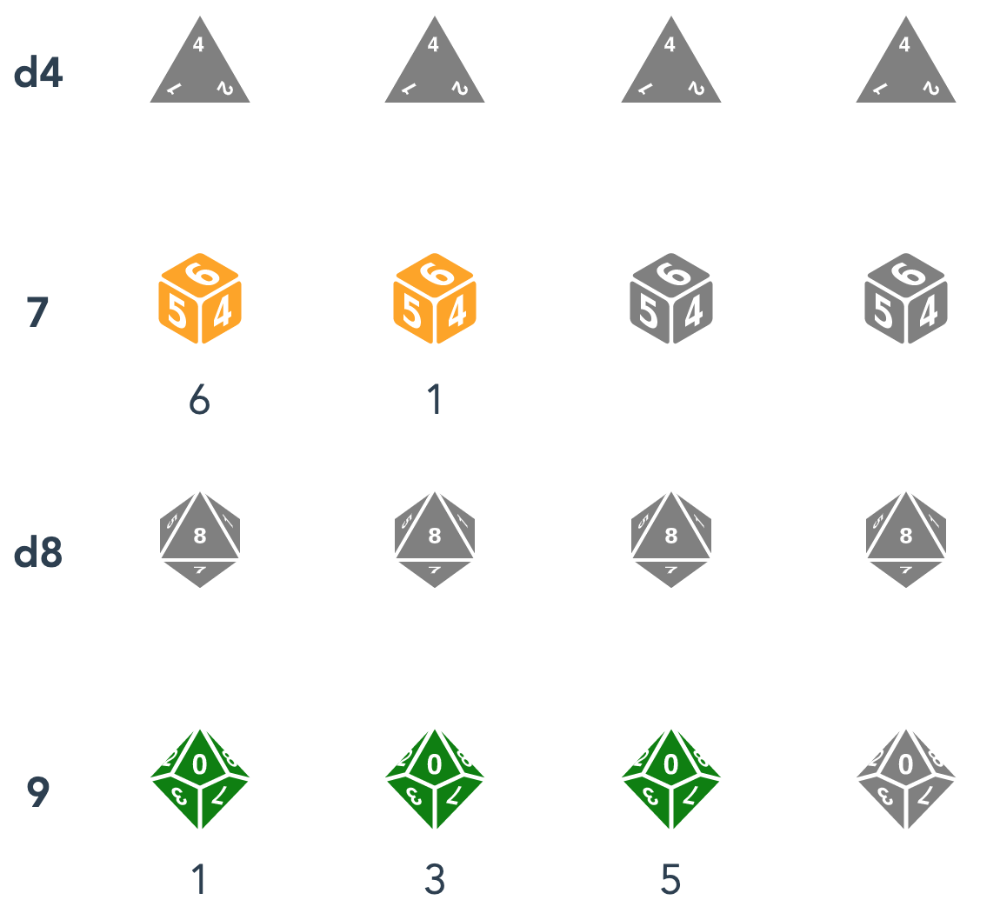

[](https://app.netlify.com/sites/rollaway/deploys)
# dice-roller

## Description

Deployment: https://rollaway.netlify.com/

A dice roller with a dead simple interface for use on mobile.
Click or touch the type and quantity of die you need to roll. 
The total sum of the roll is displayed to the left of the dice.

<div>

</div>

## Acknowledgements

SVG icons courtesy of https://game-icons.net/

## Project setup

```
npm install
```

### Compiles and hot-reloads for development

```
npm run serve
```

### Compiles and minifies for production

```
npm run build
```
